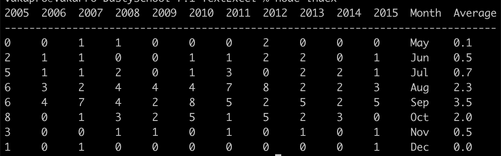

## Текстовый Excel

Выведите файл sample1.csv (лежит в репозитории) в виде Ascii-таблицы (Это как в результатах тестов табличка или как в Norton Commander).

Для усложения можете не открывать подсказку

Подсказка

  > Конечно, можно вывести данные самому, но это геморрой и наврядли получится сделать под любые файлы, поэтому лучше взять готовый пакет, таких немало: https://www.npmjs.com/search?q=ascii-table

\
**Описание:** Сервер переводит c csv to JSON в ввиде массива объектов, далее сортирует массив значений заголовка таблицы, используя значения которого вынимаются значения из остальных объектов полученного массива объектов и создается массив массивов, которые в дальнейшем отрисовываются в таблицу.

